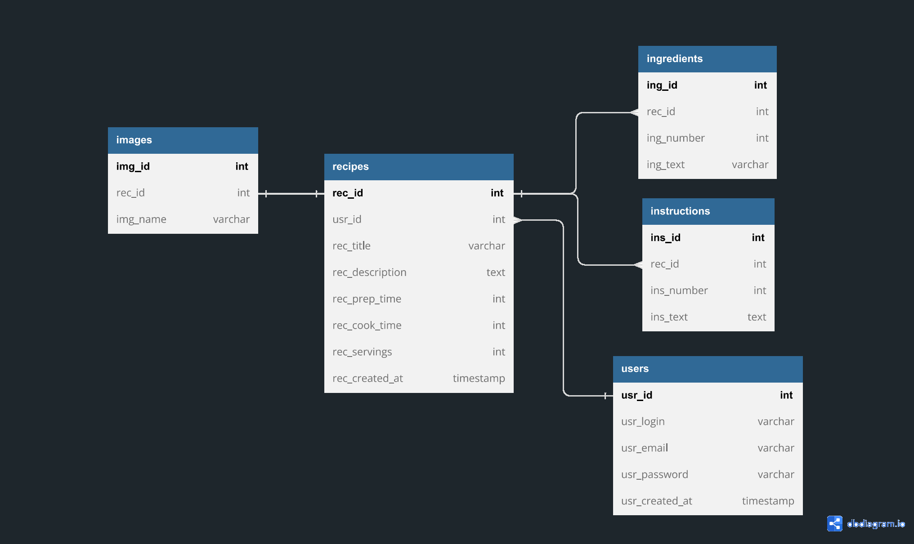

# CATKOOK

## FUNKCJONALNOŚCI:
- rejestracja
- logowanie
- wylogowywanie
- dodanie przepisu
- usunięcie przepisu
- wyszukanie przepisu
- podgląd przepisu
## DIAGRAM UML KLAS:

## DIAGRAM ERD BAZY:

## PRZYKŁAD DZIAŁANIA:
### logowanie:
##### Po wejściu na stronę główną mamy możlowość zalogowania lub przejścia na podstronę z rejestracją.

### rejestracja:
##### Wymagany jest unikatowy login oraz adres email, rzecz jasna przy podawaniu maila oraz hasła wartości w obu polach muszą się zgzadzać, w przeciwnym wypadku serwer zgłosi błąd.

### strona główna:
##### Na stronie główniej znajdują się wszystkie przepisy dodane przez danego użytkownika.

### wyszukiwanie:
##### Użytkownik posiada możliwość wyszukiwania przepisów po tytule.

#### wygląd mobilny

### dodawanie przepisu:
##### Po wciśnięciu ADD RECIPE w navbarze przechodzimy do dodawania przepisów. Użytkownik ma możliwość dodać różną ilość pól z instrukcjami oraz składnikami.

### podgląd przepisu:
##### Poniżej znajduje się podgląd przepisu dostosowany do urządzeń mobilnych. Na samym dole widnieje przycisk umożliwiający usunięcie przepisu.

### wylogowywanie:
##### po wylogowaniu użytkownik zostaje przeniesiony na stronę głowną wraz z odpowiednim komunikatem.

### zabezpieczenia:
##### Przy próbie wejścia na podstronę bez uprzedniego zalogowania wyświetlany jest widok logowania wraz z komunikatem.

## UŹYTE WZORCE PROJEKTOWE:
### - MVC

W projekcie opartym na wzorcu Model-View-Controller (MVC), modele pełnią kluczową rolę w reprezentowaniu danych aplikacji. Umieszczenie modeli w folderze "src/models" ma na celu wyodrębnienie ich jako oddzielnych komponentów odpowiedzialnych za reprezentację danych i definiowanie struktury informacji.

Modele w folderze "src/models" są obiektami, które reprezentują strukturę danych aplikacji. Odpowiadają za definiowanie właściwości i zachowań tych danych, niezależnie od logiki biznesowej. W przypadku, gdy logika biznesowa jest wyodrębniona do repozytorium, modele skupiają się głównie na reprezentowaniu danych i nie zawierają logiki.

Folder "src/repository" zawiera repozytorium, które jest odpowiedzialne za obsługę logiki biznesowej aplikacji. Repozytorium pobiera, przetwarza i zapisuje dane, korzystając z modeli do reprezentacji tych danych. Logika biznesowa jest zaimplementowana w repozytorium, a modele są wykorzystywane jako struktury danych.

Kontrolery, które znajdują się w folderze "src/controllers", obsługują żądania użytkownika i komunikują się zarówno z repozytorium, jak i widokami. Kontrolery pobierają dane z repozytorium za pomocą odpowiednich metod, a następnie przekazują je do widoków w celu wyświetlenia.

Folder "public/views" zawiera pliki, które odpowiadają za prezentację danych użytkownikowi. Widoki wykorzystują modele do wyświetlania danych w czytelnej i atrakcyjnej formie. Kontrolery korzystają z repozytorium, aby pobierać dane, a następnie przekazują je do odpowiednich widoków w celu ich prezentacji.

Podsumowując, modele w folderze "src/models" reprezentują strukturę danych aplikacji, a repozytorium w folderze "src/repository" obsługuje logikę biznesową. Kontrolery w folderze "src/controllers" obsługują interakcje między warstwą prezentacji a danymi, a widoki w folderze "public/views" odpowiadają za prezentację danych użytkownikowi. Dzięki temu podziałowi odpowiedzialności i strukturze projektu opartej na MVC możliwe jest lepsze zarządzanie kodem i rozdzielenie różnych aspektów aplikacji.

### - Repository Pettern

Wracając do folderu "src/repository" warto zauważyć kolejny wzorzec projektowy znajdujący się w aplikacji, który umożliwia separację logiki dostępu do danych od reszty aplikacji w kontekście wzorca Model-View-Controller (MVC). Repozytorium zawarte w tym folderze obsługuje operacje CRUD (Create, Read, Update, Delete) na danych w bazie. Jego głównym celem jest zapewnienie jednolitego interfejsu do manipulacji danymi, bez konieczności bezpośredniego kontaktu z bazą danych. W ten sposób wzorzec Repository ułatwia zarządzanie danymi i wprowadza elastyczność w przypadku ewentualnych zmian w źródle danych, zachowując jednocześnie separację logiki dostępu do danych od innych komponentów aplikacji w kontekście MVC.

### - Dependency Injection

Wstrzykiwanie zależności (DI) polega na przekazywaniu obiektów, które są wymagane przez daną klasę, zamiast tworzenia ich bezpośrednio wewnątrz klasy. Poprzez zastosowanie DI, klasy nie muszą być świadome, jak ich zależności są tworzone lub zaimplementowane, co prowadzi do luźnego powiązania i większej elastyczności w projektowaniu aplikacji.

W przypadku struktury katalogowej "src/controllers", "src/models" i "src/repository", można wykorzystać kontener DI do zarządzania zależnościami. Kontener DI, taki jak popularne biblioteki czy frameworki, umożliwia łatwe skonfigurowanie i dostarczenie wymaganych zależności dla klas w aplikacji. Dzięki temu można łatwo wymieniać implementacje poszczególnych komponentów, a także testować je niezależnie poprzez dostarczanie im zależności w kontekście testowym.

Wykorzystanie DI w projekcie pozwala na większą modularność, skalowalność i testowalność kodu. Pozwala również na łatwe wprowadzanie zmian w implementacji poszczególnych komponentów, ponieważ zależności są wstrzykiwane i konfigurowane na poziomie kontenera DI, a nie na poziomie kodu, co minimalizuje wpływ zmian na inne części aplikacji.

### - Front Controller 

W pliku index.php, po rozpoczęciu sesji, następuje parsowanie ścieżki z żądania HTTP. Wykorzystywany jest klasa Router, która definiuje mapowanie ścieżek żądań na konkretne kontrolery.

Na przykład, żądania typu POST o pustej ścieżce są obsługiwane przez kontroler DefaultController, żądania o ścieżce "login" są obsługiwane przez kontroler SecurityController, a żądania o ścieżce "removeRecipe" i "addRecipe" są obsługiwane przez kontroler RecipeController. Ponadto, żądania takie jak "logout" i "register" również są obsługiwane przez kontroler SecurityController.

Natomiast żądania typu GET, takie jak "main", "recipe" i "search", są przekierowywane do kontrolera RecipeController.

Wszystkie te mapowania ścieżek są zdefiniowane w Routerze, który następnie wywołuje metodę run(), przekazując w parametrze zparsowaną ścieżkę z żądania. To powoduje obsługę żądania przez odpowiedni kontroler na podstawie mapowania.

Dzięki zastosowaniu wzorca Front Controller w pliku index.php, wszystkie żądania są skierowane do jednego punktu wejścia, co ułatwia zarządzanie i routowanie żądaniami w aplikacji.

### - Singleton

Wzorzec Singleton jest wykorzystywany w klasie Database.php, która implementuje jednostkową instancję (singleton) dla zarządzania połączeniem z bazą danych.

Klasa Database.php zapewnia tylko jedną instancję połączenia z bazą danych, co eliminuje potrzebę tworzenia wielu instancji tego samego połączenia i oszczędza zasoby systemowe. Wzorzec Singleton jest używany w celu zapewnienia globalnego dostępu do tej jednej instancji w różnych miejscach aplikacji.

Przykładowo, w klasie Database.php zdefiniowana jest statyczna metoda getInstance(), która zwraca instancję klasy Database. Jeśli instancja już istnieje, to jest ona zwracana, w przeciwnym razie tworzona jest nowa instancja.

Dzięki wykorzystaniu wzorca Singleton, można uniknąć tworzenia niepotrzebnych instancji połączenia z bazą danych i zapewnić, że wszystkie komponenty aplikacji korzystają z tego samego połączenia. To z kolei przyczynia się do oszczędności zasobów i utrzymania spójności połączenia w całej aplikacji.
## PRZYSZŁOŚĆ PROJEKTU:
- poprawienie czytelności kodu
  - rozbicie widoków na elementy
  - zmiana nazewnictwa elementów
  - podział pliku css
- dodatkowe zabezpieczenia
- dodanie grupowania przepisów przy pomocy tagów
- dodanie opcji usunięcia konta
- podglądu profilu
- przeglądania ogólnodostępnych przepisów
- kalkulatory diet
- tworzenie listy zakupów...

